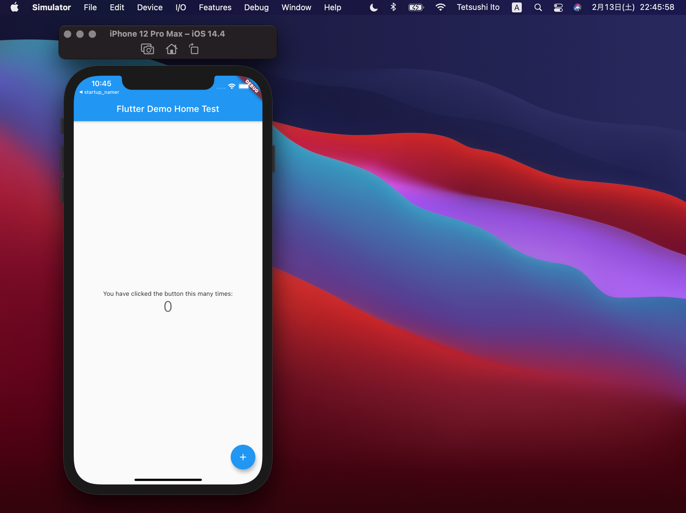

# 作業予定（v1）

- Flutterに関する基本知識のインプット
- 効率的に学ぶ方法を検討
- 学習の中間ゴールの決定
- 次回の作業内容の決定

# Flutterに関する基本知識のインプット

- Flutterに関する知識はほぼゼロなので、学び方等を決めるために広く浅く調査
  - 「Flutter 入門」Google検索結果
    - [【入門】はじめての Flutter](https://qiita.com/nskydiving/items/4fcf0dbad923d50601f9)
      - 2020/06/03 更新
    - [Flutter入門のためのDart入門](https://qiita.com/teradonburi/items/913fb8c311b9f2bdb1dd)
      - 2020/09/09 更新
    - [Flutter入門！基本知識からHello World、おすすめ勉強方法も解説](https://udemy.benesse.co.jp/development/app/flutter-intro.html)
      - 2019/11/25 更新
  - [公式サイト](https://flutter.dev/)を確認
- Flutterとは
  - 参考
    - [公式サイト](https://flutter.dev/)
    - [Wikipedia](https://ja.wikipedia.org/wiki/Flutter)
  - Flutter is Google’s UI toolkit for building beautiful, natively compiled applications for mobile, web, and desktop from a single codebase.
  - ReactNativeやCapacitorのように、単一のコードベースでモバイルアプリ・デスクトップアプリ・Webを開発しようというフレームワーク
  - Googleが開発している
  - オープンソース
  - 2018/12/04 バージョン1.0リリース
- Flutterを使って作られたアプリ
  - https://flutter.dev/showcase

# 効率的に学ぶ方法

- 公式サイトのチュートリアルがシンプルでわかりやすいのでそれをまずやってみるのが良さそう
  - [Write your first Flutter app, part 1](https://flutter.dev/docs/get-started/codelab)
    - スタートアップ企業の名前を提案するサンプルアプリ
- チュートリアルを終えた後は、一通り公式ドキュメントを読む
  - 事前に知りたいことをリストアップしてから読むのが良さそう。モバイルアプリ開発という点では、今までやってきたCordova/CapacitorやReactNativeと大きくは変わらないはず。
    - UIの構築方法
    - バックエンドとの通信方法
    - フォームの構築方法
    - デバッグ方法
    - ビルド方法
    - バイナリ作成方法
    - プラグイン・外部パッケージの利用方法
    - Firebaseの導入方法
    - ローカルストレージの利用方法
    - Reduxのようなストアの構築方法

# 作業予定（v2）

- 完了：Flutterに関する基本知識のインプット
- 完了：効率的に学ぶ方法を検討
- 環境構築とシミュレーターでのサンプルアプリの起動
- 公式サイトのチュートリアルの進行
- 学習の中間ゴールの決定
- 次回の作業内容の決定

# 環境構築とシミュレーターでのサンプルアプリの起動

- [公式サイトのインストール手順](https://flutter.dev/docs/get-started/install/macos)通りに進行
  - SDKをダウンロード
  - `~/flutter` に展開
  - `~/.bash_profile` を編集して環境変数 `$PATH` を設定
  - `$ flutter doctor` コマンドを実行して、未完了な項目を解消
  - XcodeとAndroid Studioは既にインストール済みなのでスキップ
- サンプルアプリケーションの起動
  - `$ open -a Simulator`
    - iOSのシミュレーターを起動
  - `$ flutter create my_app`
    - CLIでアプリの雛形を作成
  - `$ cd my_app`
  - `$ flutter run`
    - Flutterの開発環境を起動
- 開発環境の操作
  - r Hot reload. 🔥🔥🔥
  - R Hot restart.
  - h Repeat this help message.
  - d Detach (terminate "flutter run" but leave application running).
  - c Clear the screen
  - q Quit (terminate the application on the device).

# 公式サイトのチュートリアルの進行

- チュートリアル
  - https://flutter.dev/docs/get-started/codelab
- ここからはVSCodeで進行
  - VSCodeにはFlutterとDartのプラグインをインストールした
- VSCodeで新規プロジェクトを作成
  - コマンドパレット → Flutter: New Application Project
- `lib/main.dart` を編集していく
  - Dartにおけるエントリポイントは `main()`
  - `StatelessWidget` クラスを継承した `MyApp` クラスでFlutterアプリを初期化する
    - `void main() => runApp(MyApp());`
- Flutterでは、UIもDartコードで構築していく模様
  - Ionic/CapacitorではWebの技術でアプリケーション部分を実装していたので、基本HTMLで書いていた
  - XMLのような（ `<>` がよく登場する）書き方ではない形でUIを構築するのが初めてで新鮮
  - Swift UIがそのような感じだと聞いたことがある
- Flutterでは全てのUIは「Widget」で構築される
- `Scaffold` ウィジェットに `appBar` と `body` プロパティを指定することで、ヘッダー部分とメインコンテンツ部分を作ることができる
- 外部パッケージの利用には、Dartのパッケージマネージャーを利用する
  - パッケージのレジストリは [pub.dev](https://pub.dev/)
  - 依存関係やプロジェクトの詳細は `pubspec.yml` に記述する
    - RubyのGemfile / JSのpackage.json / iOSのpodfile等々に相当しそう
  - インストールされたパッケージのバージョンは `pubspec.lock` に書き込まれる
- パッケージをコード中で利用するには、ファイルの先頭で `import` する
  - パッケージを `import` することで、パッケージで `export` されている関数・クラスを利用できるようになる模様
    - TypeScriptのように、具体的にインポートするクラス名・関数名を指定する必要はないらしい
      -  `import { myFunc } from 'mylib';` 
- Stateless Widget
  - Stateless widgets are immutable, meaning that their properties can’t change—all values are final.
- Stateful Widget
  - Stateful widgets maintain state that might change during the lifetime of the widget. Implementing a stateful widget requires at least two classes: 1) a StatefulWidget class that creates an instance of 2) a State class. The StatefulWidget class is, itself, immutable and can be thrown away and regenerated, but the State class persists over the lifetime of the widget.

# 学習の中間ゴールの決定

- リストアップした疑問点を全て解決する
- 自分でアイデアを練ったサンプルアプリケーションを開発する

# 次回の作業内容の決定

- 公式ドキュメントを全て読む
- Flutter入門系のWebの記事を10〜20記事読む
- 以下の疑問点を解消する
  - UIの構築方法
  - バックエンドとの通信方法
  - フォームの構築方法
  - デバッグ方法
  - ビルド方法
  - バイナリ作成方法
  - プラグイン・外部パッケージの利用方法
  - Firebaseの導入方法
  - ローカルストレージの利用方法
  - Reduxのようなストアの構築方法
- 次回の作業予定の検討

# 感想

- Cordova/CapacitorでiOS/Androidアプリを開発していたときは、基本的にXcodeとAndroid Studioを起動してアプリをビルドしてシミュレーターや実機で起動していたが、FlutterではCLI上で完結するため、重いIDEを開かなくてよいのが嬉しい。
- Hot Reloadが非常に快適。Webの開発では、React/Angular/Vue(Nuxt)ではスムーズなHot Module Replacementが実現できていたが、Cordova/Capacitorを使ったモバイルアプリ開発ではHot Reloadの実行環境まで構築できていなかった。モバイルアプリ開発でもHot Reloadが利用できるのは非常に開発スピードの向上につながりそう。
