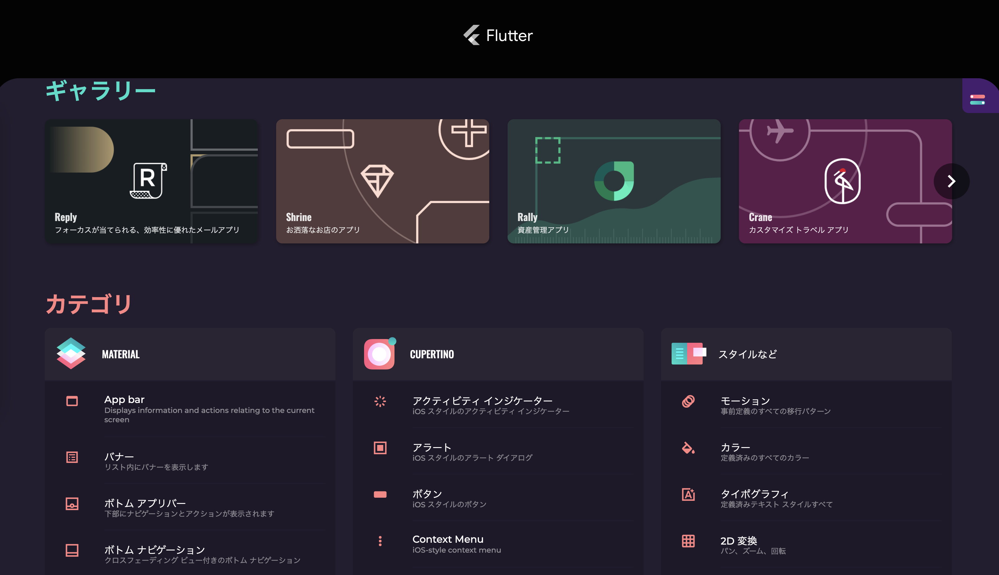

# 作業予定（v1）

- 公式ドキュメントを全て読む
- Flutter入門系のWebの記事を10〜20記事読む
- 以下の疑問点を解消する
  - UIの構築方法
  - バックエンドとの通信方法
  - フォームの構築方法
  - デバッグ方法
  - ビルド方法
  - バイナリ作成方法
  - プラグイン・外部パッケージの利用方法
  - Firebaseの導入方法
  - ローカルストレージの利用方法
  - Reduxのようなストアの構築方法
- 次回の作業予定の検討

# 公式ドキュメントを全て読む

## 目次

- Get started
- Samples & tutorials
- Development
- Testing & debugging
- Performatnce & optimization
- Deployment
- Resources
- Reference

## Get started

- Flutter本体のインストール方法
  - Windows / macOS / Linux / Chrome OS（！）
- エディタの設定
  - Android Studio and IntelliJ
  - VS Code
  - Emacs
- テスト起動
  - iOSシミュレーターを利用
  - CLIで雛形を生成
- サンプルアプリケーションの開発
  - Startup Name Generator
    - [Part2](https://codelabs.developers.google.com/codelabs/first-flutter-app-pt2#0)
- Learn more
  - 他の技術の利用者向けのガイド
    - [Flutter for React Native developers](https://flutter.dev/docs/get-started/flutter-for/react-native-devs)
    - [Flutter for web developers](https://flutter.dev/docs/get-started/flutter-for/web-devs)
- From another platform?
  - 他FW利用者向けのガイド

### Introduction to declarative UI

- https://flutter.dev/docs/get-started/flutter-for/declarative
- declarative UI = 宣言的UI
- inperative UI = 命令的UI
- declarative styleとimperative styleの比較
- declarative UIを使う理由
  - Win32・Web・Android・iOSではimperative styleを使う
  - UIView等々を使ってUIを構築し、メソッドやsetterを使って変更する
  - 様々なUIの状態の間のtransitionの実装の工数を軽くするため、Flutterでは開発者は現在のUIの状態のみを定義し、transitionはフレームワークに任せる
  - UI構築にリソースを割かなくてもよくなる
- declarative frameworkでUIがどう変わるか？
  - imperative styleではセレクタで要素を取得し、変更を適用する必要がある
  - declarative styleでは、ビュー（Flutterで言うWidget）の設定はイミュータブル
  - UIを変更するには、Widgetは自身でrebuildを実行することでWidgetのツリーを再構築する
    - Flutterでは一般的に `StatefulWidgets` の `setState()` を叩くことで実行
  - 既存のコンポーネントインスタンスを変更するのではなく、Flutterは新しいインスタンスを作成する

### Building a web application with Flutter

- https://flutter.dev/docs/get-started/web
- FlutterはまだWebを正式サポートしていない
  - Betaチャンネルを利用する必要あり
- Flutter Webの現状について
  - [Flutter Webの現状調査](https://ntaoo.hatenablog.com/entry/2019/05/22/152739) 
    - 2019/05/22
    - テキスト以外はほとんどCanvasでレンダリング
    - Custom ElementとCanvasのカタマリ
    - 位置はabsolute positionやtransformなどで調整

## Samples & tutorials

- [Flutter Gallery](https://gallery.flutter.dev/#/)
  - UIや機能からサンプルコードを探せる
  - ソースコードも公開されている
    - https://github.com/flutter/flutter/tree/master/dev/integration_tests/flutter_gallery
  - [GitHub版](https://flutter.github.io/samples/#)

- [Cookbook](https://flutter.dev/docs/cookbook)
  - 一般的な要求をどう満たすかをまとめたページ
  - 非常に参考になるので、自分のアプリを作り始める前に一通り目を通していつでも参照できる状態にしておくのが良さそう
- [Codelabs](https://flutter.dev/docs/codelabs)
  - ハンズオンが用意されている
  - 一部はダウンロード不要で、Web上のエディタで検証可能
  - Good for beginners
    - チュートリアルPart1,2
    - Web版
    - Building beautiful UIs with Flutter
      - How to write a Flutter app that looks natural on both Android and iOS
      - How to use the Android Studio IDE, using many shortcuts supported by the Flutter plugin for Android Studio and IntelliJ
      - How to debug your Flutter app
      - How to run your Flutter app on an emulator, a simulator, and a device
  - Designing a Flutter UI
- Tutorials
  - 4つのチュートリアルがある
    - Building layouts
    - Adding interactivity to your Flutter app
    - Animations in Flutter
    - Internationalizing Flutter apps

## Development

- 

# 入門系記事インプット

- [What is Flutter?](https://www.youtube.com/watch?v=I9ceqw5Ny-4)
  - Flutterが解決する課題について説明
  - Ionic/Capacitorが解決する課題とほぼ同じだったので流し聞き程度で済んだ
- [Flutter Tutorial for Beginners #1 - Intro & Setup](https://www.youtube.com/watch?v=1ukSR1GRtMU)

# 作業予定（v2）

- 公式ドキュメントを全て読む
- Flutter入門系のWebの記事を10〜20記事読む
- 公式サイトのサンプルアプリケーションのPart2をやる
- [Building beautiful UIs with Flutter](https://codelabs.developers.google.com/codelabs/flutter#0)をやる
- TextやContainerを使いつつ、適当にレイアウトを組んだりスタイルを当てたりしてみる
  - 参考：[Flutter for web developers](https://flutter.dev/docs/get-started/flutter-for/web-devs)
- [Flutter Samples](https://flutter.github.io/samples/#)のアプリケーションを最低10個コードレベルで見る
- [Dart overview](https://dart.dev/overview)を読む
- 以下の疑問点を解消する
  - UIの構築方法
  - バックエンドとの通信方法
  - フォームの構築方法
  - デバッグ方法
  - ビルド方法
  - バイナリ作成方法
  - プラグイン・外部パッケージの利用方法
  - Firebaseの導入方法
  - ローカルストレージの利用方法
  - Reduxのようなストアの構築方法
- 次回の作業予定の検討
