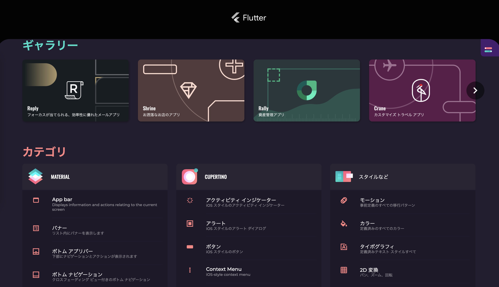

# Samples & tutorials

- [Flutter Gallery](https://gallery.flutter.dev/#/)
  - UIや機能からサンプルコードを探せる
  - ソースコードも公開されている
    - https://github.com/flutter/flutter/tree/master/dev/integration_tests/flutter_gallery
  - [GitHub版](https://flutter.github.io/samples/#)

- [Cookbook](https://flutter.dev/docs/cookbook)
  - 一般的な要求をどう満たすかをまとめたページ
  - 非常に参考になるので、自分のアプリを作り始める前に一通り目を通していつでも参照できる状態にしておくのが良さそう
- [Codelabs](https://flutter.dev/docs/codelabs)
  - ハンズオンが用意されている
  - 一部はダウンロード不要で、Web上のエディタで検証可能
  - Good for beginners
    - チュートリアルPart1,2
    - Web版
    - Building beautiful UIs with Flutter
      - How to write a Flutter app that looks natural on both Android and iOS
      - How to use the Android Studio IDE, using many shortcuts supported by the Flutter plugin for Android Studio and IntelliJ
      - How to debug your Flutter app
      - How to run your Flutter app on an emulator, a simulator, and a device
  - Designing a Flutter UI
- Tutorials
  - 4つのチュートリアルがある
    - Building layouts
    - Adding interactivity to your Flutter app
    - Animations in Flutter
    - Internationalizing Flutter apps
